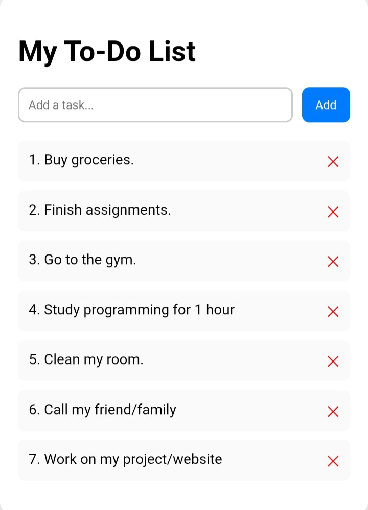

# 📝 To-Do List App

A simple and clean To-Do List application built using **HTML**, **CSS**, and **JavaScript**.  
This is one of my first beginner projects as I learn web development.

---

## 🚀 Features
- Add new tasks  
- Delete tasks  
- Smooth animations  
- Responsive design  
- Beginner-friendly clean code

---

## 📸 Screenshot

---

## 🛠 Technologies Used
- HTML  
- CSS  
- JavaScript  

---

## 🌱 Future Improvements
- Add task editing  
- Add Local storage (save tasks even after refreshing
- Add dark mode  
- Add animations on delete  

---

## 👤 Lio Mercer — Learning to code step by step.
